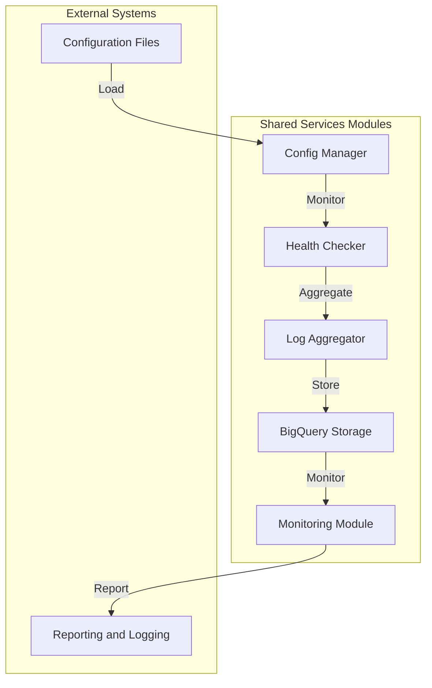

# Shared Services - Comprehensive Guide

## Overview
The Shared Services module provides centralized utilities and infrastructure components for the AI Trading Machine project. This guide outlines the project structure and describes the purpose of each file.

## Project Structure

```
shared-services/
├── bin/                     # Executable scripts for shared operations
│   ├── config_manager.py    # Centralized configuration management
│   ├── health_checker.py    # System health monitoring
│   ├── log_aggregator.py    # Log aggregation and analysis
├── config/                  # Configuration files
│   ├── global_config.yaml   # Global configuration settings
│   ├── infrastructure.yaml  # Infrastructure-specific configurations
│   └── secrets/             # Secrets and credentials
├── Dockerfile               # Docker configuration for containerization
├── docs/                    # Documentation and usage guides
├── guide.md                 # Comprehensive project guide
├── infra/                   # Infrastructure as code (Terraform)
│   ├── backend.tf           # Backend configuration
│   ├── main.tf              # Main infrastructure configuration
│   ├── modules/             # Modular infrastructure components
│   │   ├── gcs/             # Google Cloud Storage modules
│   │   ├── bigquery/        # BigQuery modules
│   │   ├── pubsub/          # Pub/Sub modules
│   │   └── workflows/       # Workflow modules
│   ├── outputs.tf           # Infrastructure outputs
│   ├── README.md            # Infrastructure documentation
│   └── variables.tf         # Global variable definitions
├── logs/                    # Log files
│   └── shared_services_{datetime.now().strftime('%Y%m%d')}.log  # Daily logs
├── README.md                # Project overview and instructions
├── requirements-dev.txt     # Development dependencies
├── requirements.txt         # Python dependencies
├── scripts/                 # Utility scripts
├── setup.py                 # Python package setup file
├── src/                     # Source code for shared services
│   ├── shared_services/
│   │   ├── __init__.py      # Module initialization
│   │   ├── utils/           # Utility functions
│   │   │   ├── logger.py    # Logging utilities
│   │   │   ├── config_parser.py  # Configuration parser
│   │   │   ├── gcp_secrets.py  # GCP secrets management
│   │   │   └── health_monitor.py  # Health monitoring utilities
│   └── shared_services.egg-info/  # Package metadata
├── tests/                   # Unit and integration tests
│   ├── e2e/                 # End-to-end tests
│   ├── integration/         # Integration tests
│   └── unit/                # Unit tests
├── todo.md                  # TODO list for future enhancements
└── update_imports.py        # Script to update Python imports
```

### Explanation
This updated structure reflects the latest additions to the project, including new scripts, infrastructure modules, and enhanced source code organization.

## Detailed File Descriptions

### `bin/`
- **config_manager.py**: Manages centralized configuration settings.
- **health_checker.py**: Monitors system health and performance.
- **log_aggregator.py**: Aggregates logs from multiple sources for analysis.

### `config/`
- **global_config.yaml**: Contains global configuration settings.
- **infrastructure.yaml**: Defines infrastructure-specific configurations.
- **secrets/**: Directory for secrets and credentials.

### `infra/`
- **backend.tf**: Backend configuration for Terraform.
- **main.tf**: Main infrastructure configuration file.
- **modules/**: Directory for modular infrastructure components.
- **outputs.tf**: Outputs for the infrastructure setup.
- **README.md**: Documentation for the infrastructure setup.
- **variables.tf**: Global variable definitions for Terraform.

### `logs/`
- **shared_services_{datetime.now().strftime('%Y%m%d')}.log**: Daily log file for shared services.

### `README.md`
- Provides an overview and instructions for using the project.

### `requirements-dev.txt`
- Development dependencies for the project.

### `requirements.txt`
- Python dependencies required for shared services.

### `scripts/`
- Utility scripts for various tasks.

### `setup.py`
- Defines the Python package setup for the project.

### `src/`
#### `shared_services/`
- **__init__.py**: Initializes the shared services module.
- **utils/**: Contains utility functions for logging, configuration parsing, and health monitoring.

### `tests/`
- **e2e/**: End-to-end tests.
- **integration/**: Integration tests.
- **unit/**: Unit tests.

### Other Files
- **todo.md**: TODO list for future enhancements.
- **update_imports.py**: Script to update Python imports.

## Usage

### Running Shared Services
```bash
# Run the configuration manager
python bin/config_manager.py

# Monitor system health
python bin/health_checker.py

# Aggregate logs
python bin/log_aggregator.py
```

### Setting Up the Environment
```bash
# Set up the environment
bash scripts/setup_environment.sh

# Install dependencies
pip install -r requirements.txt
```

### Monitoring and Logging
```bash
# View logs
cat logs/shared_services.log

# Collect metrics
python src/monitoring/metrics_collector.py
```

## Architecture Flow



### Explanation
- **Configuration Files**: YAML files defining global and infrastructure settings.
- **Config Manager**: Manages centralized configuration settings.
- **Health Checker**: Monitors system health and performance.
- **Log Aggregator**: Aggregates logs from multiple sources.
- **BigQuery Storage**: Stores aggregated logs and metrics.
- **Monitoring Module**: Tracks system performance.
- **Reporting and Logging**: Generates reports and logs for analysis.

## Future Enhancements
Refer to `todo.md` for a list of planned improvements and features.
